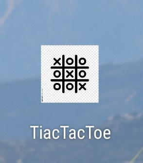
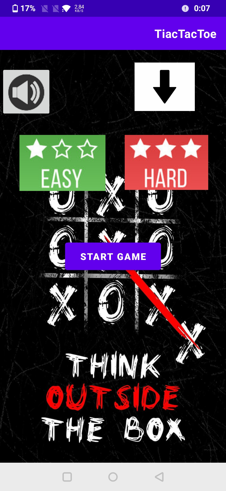
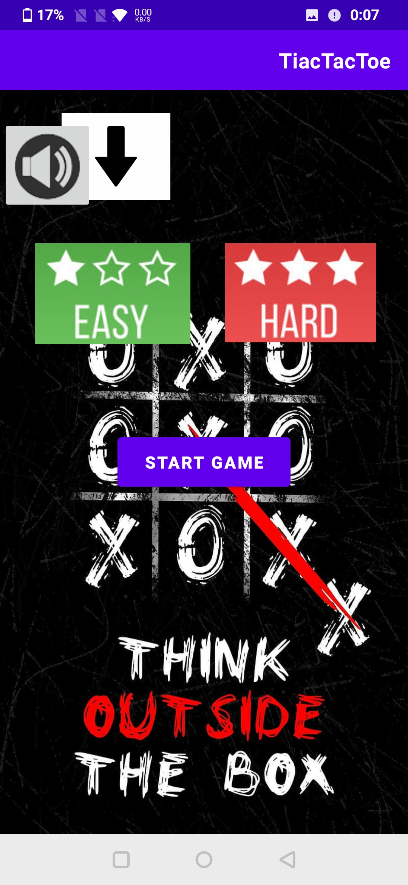
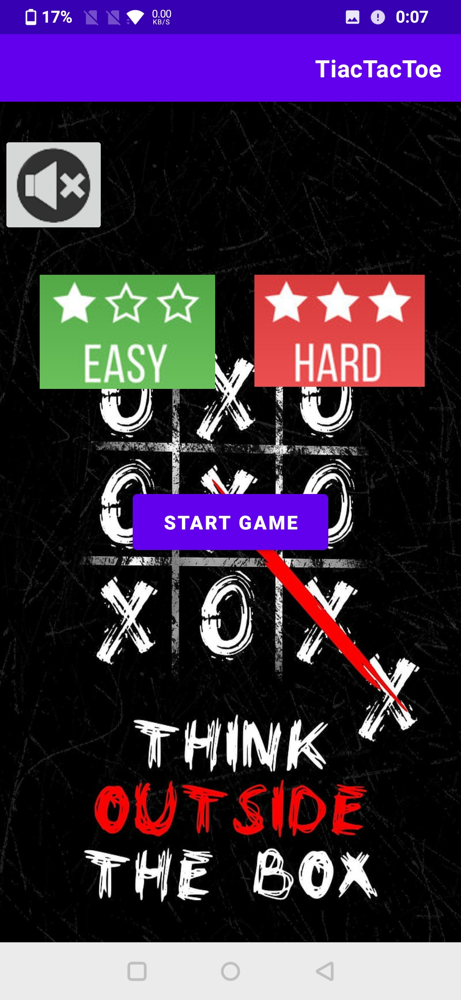
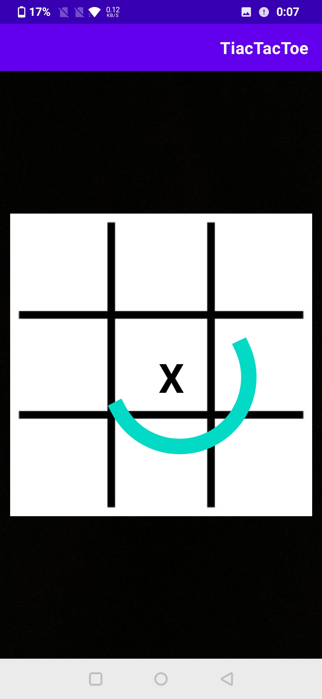
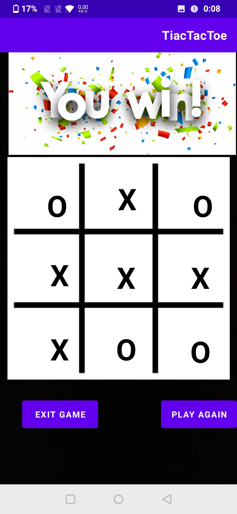
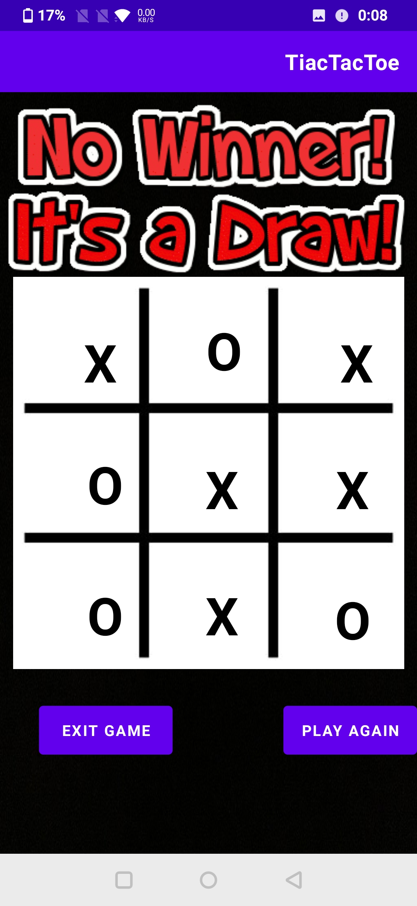
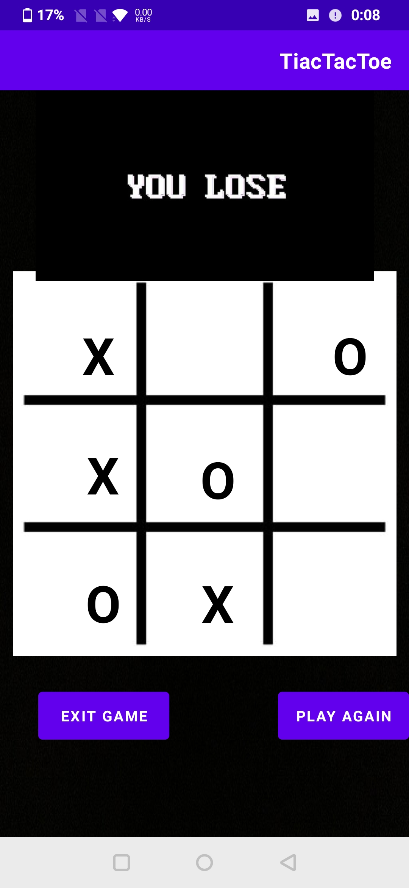

# Android Tic Tac Toe App with Music

Welcome to the Android Tic Tac Toe app repository! This mobile application, built using Java and Android Studio, brings the classic Tic Tac Toe game to your Android device.
Challenge yourself against a computer opponent with two difficulty levels: Easy and Hard, all while enjoying background music. Additionally, the app provides an option to mute and unmute the music.

## Features

- **Easy Mode:** The computer opponent makes random moves, suitable for casual gameplay.
  
- **Hard Mode:** The computer opponent is more challenging, strategically choosing moves to win or block the player.

- **Background Music:** Immerse yourself in the gaming experience with accompanying background music.

- **Mute/Unmute Option:** Toggle between muting and unmuting the background music based on your preference.

- **Mobile Friendly:** Enjoy a responsive and intuitive user interface designed for Android devices.

- 
- 
- 
- 
- 
- 
- 
- 
- 
